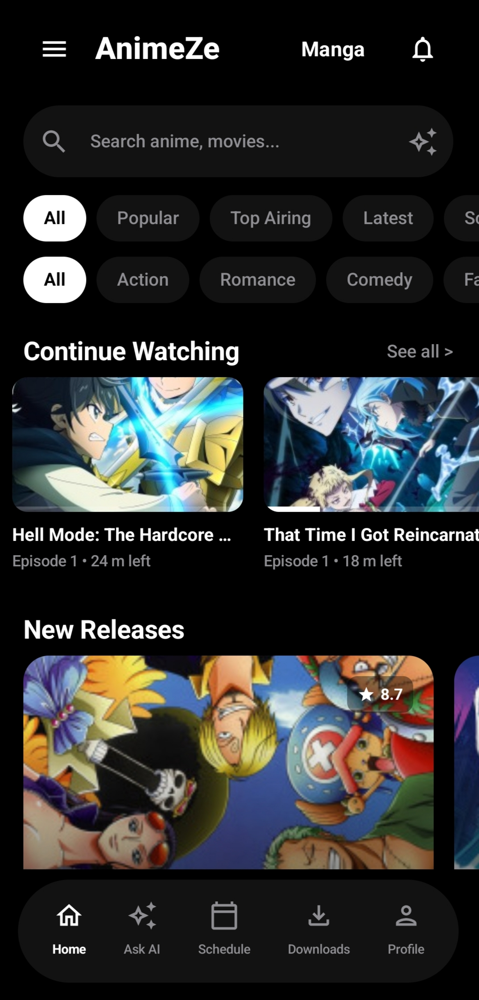
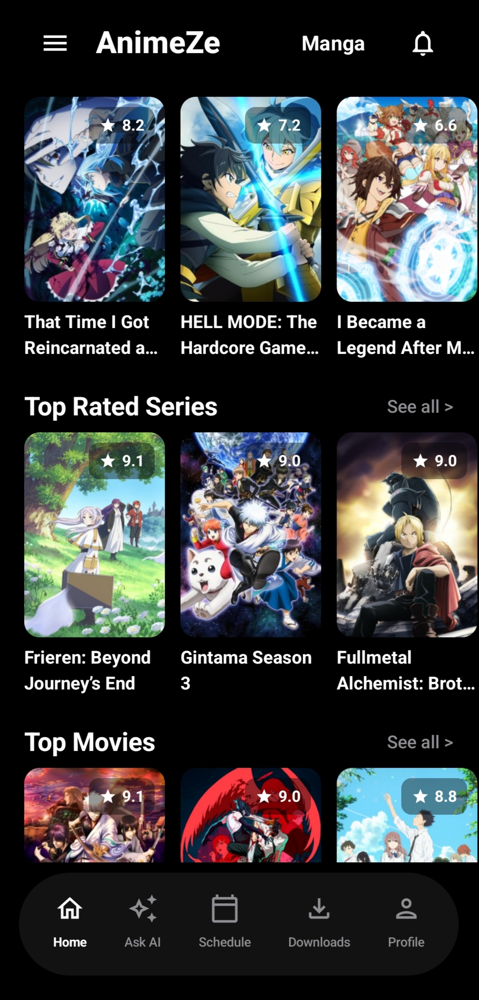
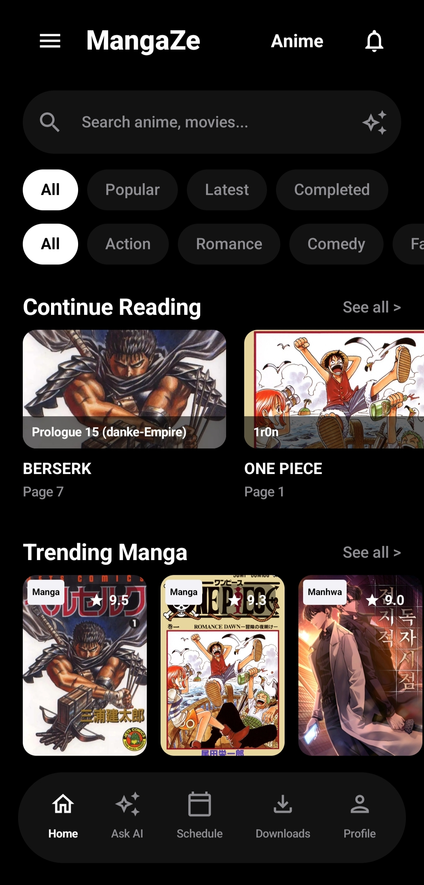
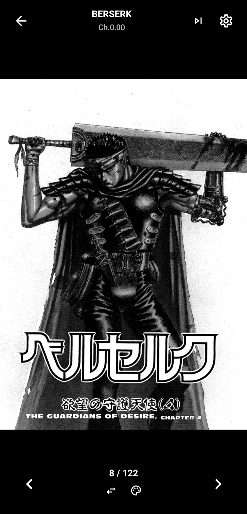
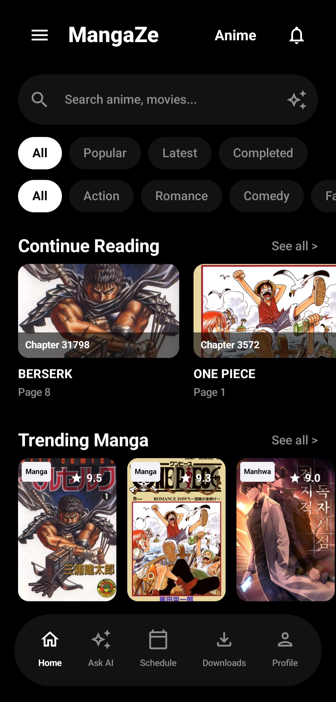
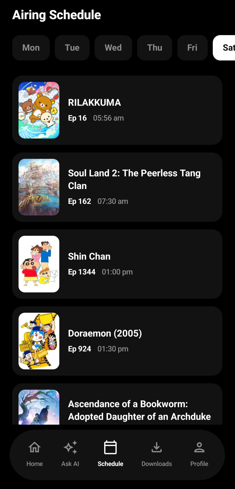
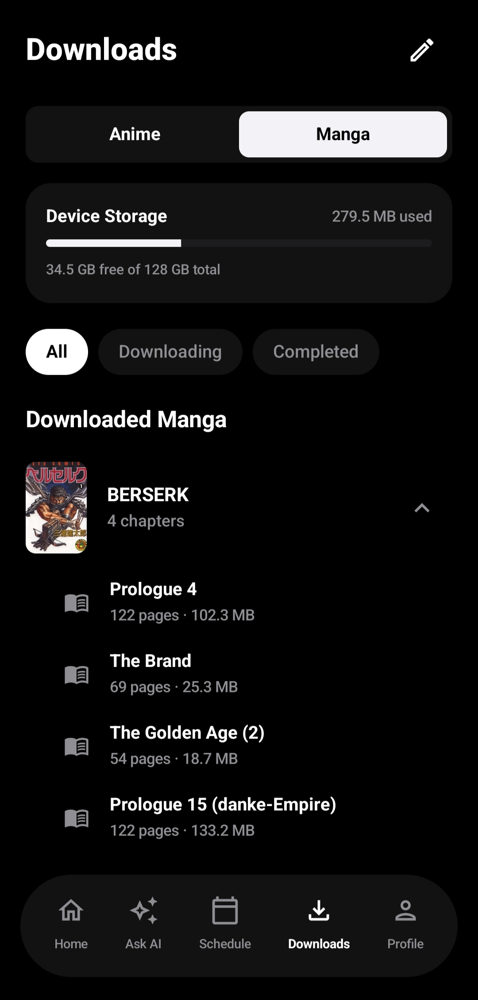
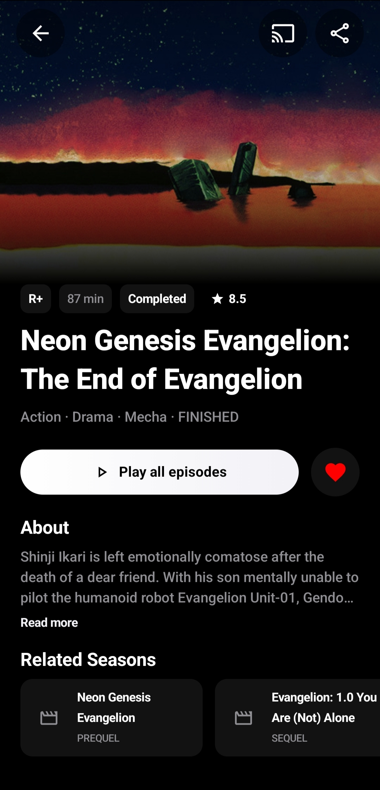

# AnimeZe

**An Android app for streaming anime and reading manga.**

---

## Overview

AnimeZe brings anime streaming and manga reading together in one clean, custom-built interface. It comes with built-in tracking, watch/read history, and offline downloads, so you can pick up right where you left off.

## Features

| Feature | Description |
|---|---|
| **Anime and Manga** | Switch seamlessly between anime streaming and manga reading in a single app. |
| **Weekly Airing Schedule** | Live countdowns and timelines for upcoming episodes. |
| **Offline Downloads** | downloader for watching and reading without an internet connection. |

## Screenshots

| | | |
|---|---|---|
|  |  |  |
|  |  |  |
|  |  | |

## Download

Get the latest build of AnimeZe from the link below.

[**Download Latest APK**](https://github.com/DeadZone-0/AnimeZe/releases/latest/download/app-release.apk)

*Currently experimental — expect occasional bugs and rough edges.*

## Bug Reports

Found something broken? Open an issue on the [Issues](https://github.com/DeadZone-0/AnimeZe/issues) page. Reports of bugs and unexpected behavior are always welcome and directly help improve the app.

---

Made by [DeadZone-0](https://github.com/DeadZone-0)

